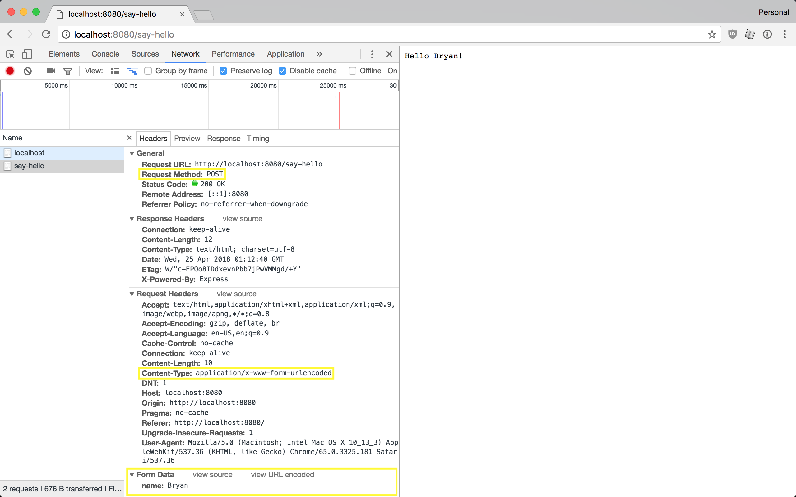

# Dynamic Routes

## Saying Hello.
So far we just served up static content. Let's try something a little more interesting, and rather than saying hello to the world, let's say hello to the user.

### Route Parameters
There different way in which HTTP servers allow for user input. One such was in the URL itself.
[include, template="full"](examples/hello_user_route.js)

Here we are allowing the user to specify their name in the URL itself. 

### Query Parameters
Another way is to use query parameters. Query parameters are also part of the URL but are specified at the end after a `?`. An example URL with query parameters might be: `https://www.google.com/search?q=query+parameters`.

In this URL we have 1 query parameter named `q` with a value of `query parameters`.

Multiple query parameters separated by an `&`. They might look like: `http://localhost:8080/?first_name=Noe&last_name=Roman`. 
[include, template="full"](examples/hello_user_query.js)

### Request Body
The final way to pass parameters is through the request body. Let's look at an example.

[include, template="full"](examples/static/request_body.html)
[include, template="full"](examples/request_body.js)

The screenshot above shows the request that the browser made to the server (and parts of the response).

#### `Request Method`
This is also referred to as the HTTP method.

Notice the `app.post` (from the server code) which tells the server to handle `POST` requests.
[import:'methodpost'](examples/request_body.js)

And the `<form method='post'>` (from the client code) which tells the client to make a `POST` request. This will default to a `GET` request if not specified.

#### `Request Headers`
This is part of the HTTP Message. These are more data passed from the client to the server. These are meta data about the request. Some useful headers are:

* `Content-Type`: This tell the server how to read the data passed in the request body.

#### `Request Body`
The default browser supported format for sending data is `application/x-www-form-urlencoded`. This encodes the data the same way query parameters do. 

(Click the `view source` link in `Form Data` in DevTools)
